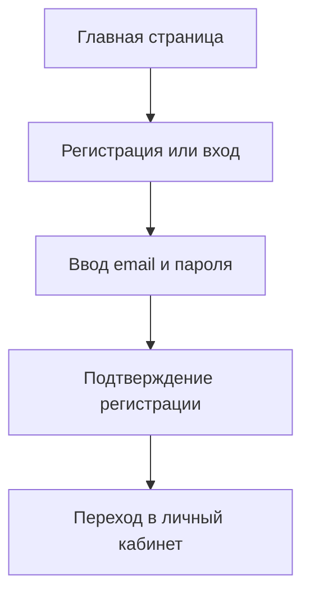
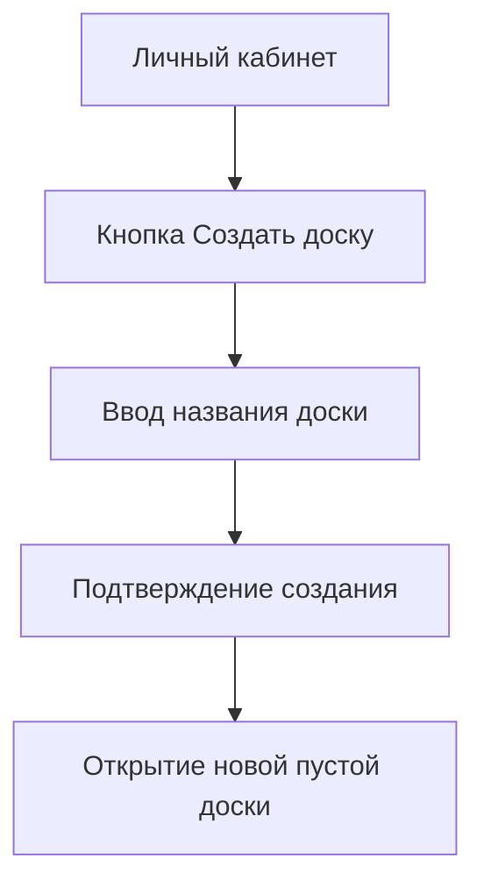
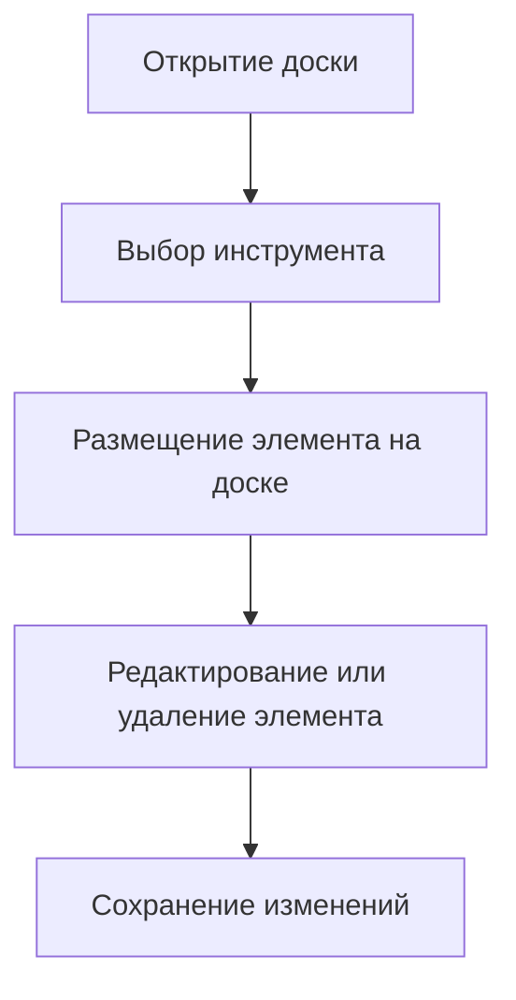
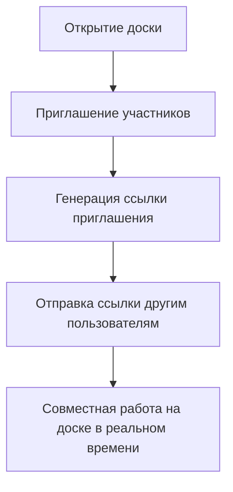
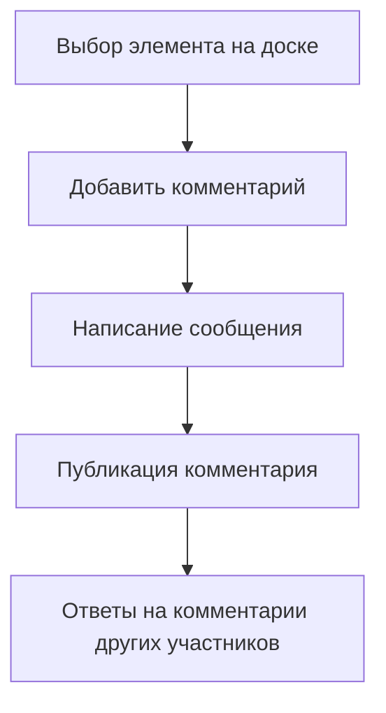
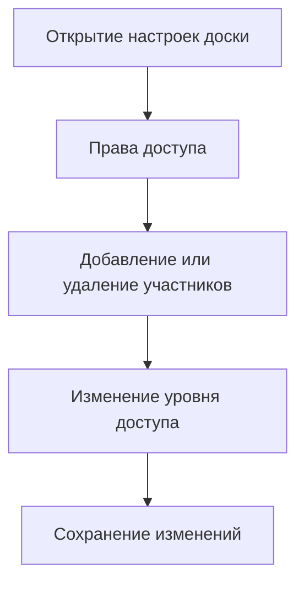
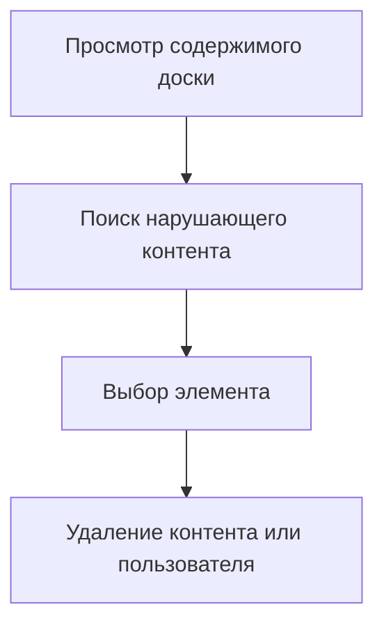
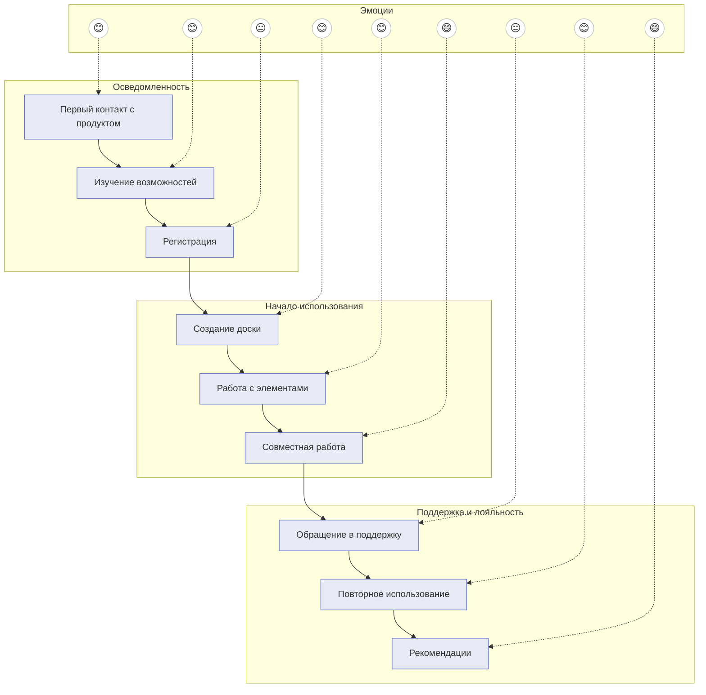
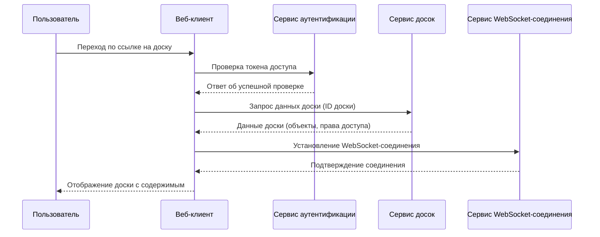
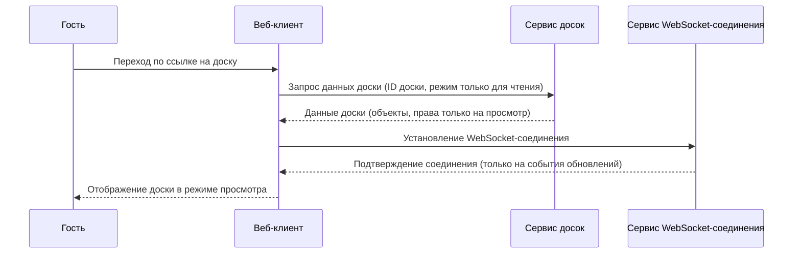

# Проектирование пользовательских сценариев и потоков

## Описание проекта

Интерактивная онлайн-доска для совместной работы в реальном времени (аналог Miro).
Пользователи могут создавать доски, размещать объекты, оставлять комментарии и работать вместе.

## Пользовательские роли

| Роль             | Описание                                                 |
|------------------|----------------------------------------------------------|
| Гость            | Может только просматривать доску по ссылке.              |
| Пользователь     | Может создавать доски, редактировать, приглашать других. |
| Администратор    | Управляет пользователями и досками, модерирует контент.  |

## Ключевые пользовательские сценарии

| Сценарий                 | Действия пользователя                                                              |
|--------------------------|------------------------------------------------------------------------------------|
| Регистрация и вход       | Переход на сайт → Регистрация или вход → Личный кабинет                            |
| Создание новой доски     | Личный кабинет → Кнопка Создать доску → Ввод названия → Пустая доска               |
| Работа на доске          | Открытие доски → Выбор инструмента → Добавление элементов → Сохранение изменений   |
| Совместная работа        | Открытие доски → Приглашение участников → Совместная работа в реальном времени     |
| Комментирование          | Выбор элемента → Добавление комментария → Ответы на комментарии                    |
| Управление доступом      | Настройки доски → Изменение прав доступа → Сохранение                              |
| Модерация контента       | Просмотр доски → Поиск нарушений → Удаление нежелательного контента или участников |

## Customer Journey Map (визуальная схема)

### Регистрация и вход

### Создание новой доски

### Работа на доске

### Совместная работа

### Комментирование

### Управление доступом

### Модерация контента

### Customer Journey Map: Интерактивная онлайн-доска (расширенная)

## UML Диаграммы взаимодействия при открытии доски

### Открытие доски как зарегистрированный пользователь

### Открытие доски как гость

