# Проектирование пользовательских сценариев и потоков

## Описание проекта

Интерактивная онлайн-доска для совместной работы в реальном времени (аналог Miro).
Пользователи могут создавать доски, размещать объекты, оставлять комментарии и работать вместе.

## Пользовательские роли

| Роль             | Описание                                                      |
|------------------|---------------------------------------------------------------|
| Гость            | Может только просматривать доску по ссылке.                   |
| Пользователь     | Может создавать доски, редактировать, приглашать других.       |
| Администратор    | Управляет пользователями и досками, модерирует контент.        |

## Ключевые пользовательские сценарии

| Сценарий                | Действия пользователя                                                                      |
|--------------------------|-------------------------------------------------------------------------------------------|
| Регистрация и вход       | Переход на сайт → Регистрация или вход → Личный кабинет                                   |
| Создание новой доски     | Личный кабинет → Кнопка Создать доску → Ввод названия → Пустая доска                     |
| Работа на доске          | Открытие доски → Выбор инструмента → Добавление элементов → Сохранение изменений         |
| Совместная работа        | Открытие доски → Приглашение участников → Совместная работа в реальном времени           |
| Комментирование          | Выбор элемента → Добавление комментария → Ответы на комментарии                          |
| Управление доступом      | Настройки доски → Изменение прав доступа → Сохранение                                     |
| Модерация контента       | Просмотр доски → Поиск нарушений → Удаление нежелательного контента или участников       |

## Customer Journey Map (визуальная схема)

### Регистрация и вход

```mermaid
flowchart TD
    A[Главная страница] --> B[Регистрация или вход]
    B --> C[Ввод email и пароля]
    C --> D[Подтверждение регистрации]
    D --> E[Переход в личный кабинет]
```



### Создание новой доски

```mermaid
flowchart TD
    A[Личный кабинет] --> B[Кнопка Создать доску]
    B --> C[Ввод названия доски]
    C --> D[Подтверждение создания]
    D --> E[Открытие новой пустой доски]
```



### Работа на доске

```mermaid
flowchart TD
    A[Открытие доски] --> B[Выбор инструмента]
    B --> C[Размещение элемента на доске]
    C --> D[Редактирование или удаление элемента]
    D --> E[Сохранение изменений]
```



### Совместная работа

```mermaid
flowchart TD
    A[Открытие доски] --> B[Приглашение участников]
    B --> C[Генерация ссылки приглашения]
    C --> D[Отправка ссылки другим пользователям]
    D --> E[Совместная работа на доске в реальном времени]
```



### Комментирование

```mermaid
flowchart TD
    A[Выбор элемента на доске] --> B[Добавить комментарий]
    B --> C[Написание сообщения]
    C --> D[Публикация комментария]
    D --> E[Ответы на комментарии других участников]
```



### Управление доступом

```mermaid
flowchart TD
    A[Открытие настроек доски] --> B[Права доступа]
    B --> C[Добавление или удаление участников]
    C --> D[Изменение уровня доступа]
    D --> E[Сохранение изменений]
```



### Модерация контента

```mermaid
flowchart TD
    A[Просмотр содержимого доски] --> B[Поиск нарушающего контента]
    B --> C[Выбор элемента]
    C --> D[Удаление контента или пользователя]
```



### Customer Journey Map: Интерактивная онлайн-доска (расширенная)

```mermaid
%% Расширенная CJM с этапами, фазами и линией эмоций
flowchart TD

    subgraph Осведомленность
        A1[Первый контакт с продуктом]
        A2[Изучение возможностей]
        A3[Регистрация]
    end

    subgraph Начало использования
        B1[Создание доски]
        B2[Работа с элементами]
        B3[Совместная работа]
    end

    subgraph Поддержка и лояльность
        C1[Обращение в поддержку]
        C2[Повторное использование]
        C3[Рекомендации]
    end

    A1 --> A2 --> A3 --> B1 --> B2 --> B3 --> C1 --> C2 --> C3

    %% Эмоциональная линия пользователя (визуально показать настроение)
    subgraph Эмоции
        E1((😊))
        E2((😊))
        E3((😐))
        E4((😊))
        E5((😊))
        E6((😄))
        E7((😐))
        E8((😊))
        E9((😄))
    end

    E1 -.-> A1
    E2 -.-> A2
    E3 -.-> A3
    E4 -.-> B1
    E5 -.-> B2
    E6 -.-> B3
    E7 -.-> C1
    E8 -.-> C2
    E9 -.-> C3

    classDef phase fill:#e8eaf6,stroke:#5c6bc0,stroke-width:1px;
    classDef emotion fill:#ffffff,stroke:#bdbdbd,font-size:18px;
    class A1,A2,A3,B1,B2,B3,C1,C2,C3 phase;
    class E1,E2,E3,E4,E5,E6,E7,E8,E9 emotion;
```
