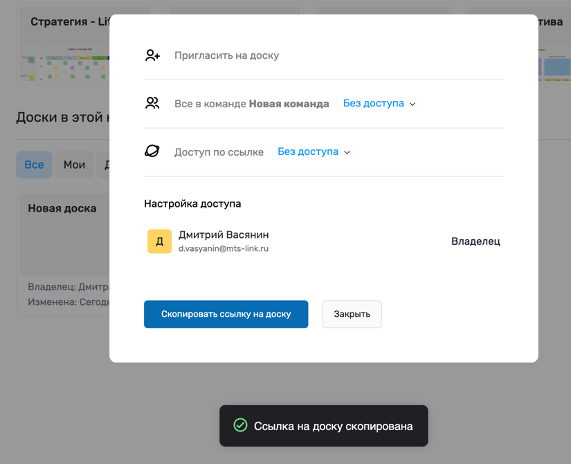

# Руководство пользователя: Интерактивная онлайн-доска

## Введение

Интерактивная онлайн-доска - это веб-приложение для визуального совместного взаимодействия.  
Вы можете создавать доски, добавлять на них фигуры, делиться ими с коллегами и работать над проектами в реальном времени.

Целевая аудитория:
- Команды (разработчики, дизайнеры, аналитики).
- Преподаватели и студенты.
- Менеджеры и продуктовые команды.
- Все, кому важно визуализировать задачи и идеи.

---

## Начало работы

### Регистрация
1. На странице регистрации выберите удобный способ входа http://localhost:8080/signup/:
    - по email;
    - через Google / Office365 (если включено);
    - SSO организации (если включено).

2. После подтверждения регистрации вы можете открыть личный кабинет http://localhost:8080/dashboard/.

### Авторизация
1. Перейдите на http://localhost:8080/dashboard/.
2. Если у вас пока еще нет аккаунта, система покажет форму входа автоматически.
3. Если аккаунт уже есть, вы автоматически попадете в свой личный кабинет.
3. Авторизуйтесь удобным для вас способом.
   - по email и паролю;
   - через Google / Office365 (если включено);
   - SSO организации (если включено).

---

## Работа с досками

### Создание новой доски
1. В личном кабинете нажмите **«Создать доску»**.
2. Введите название.
3. Доска сразу откроется и вы можете приступить к работе! Так же доска появится в списке ваших досок.

### Открытие существующей доски
1. Нажмите на название доски в списке - доска откроется в рабочем пространстве.

### Удаление доски
1. Наведите курсор на доску в списке.
2. Нажмите значок **«...»** и выберите **Удалить**.
3. Подтвердите действие.

---

### Работа на доске
- Добавляйте фигуры: прямоугольники, круги, линии, стрелки.
- Перемещайте и изменяйте размеры объектов.
- Редактируйте текст прямо на доске.
- Изменяйте цвет и стиль объектов через панель инструментов.

### Совместная работа с доской
- Наведите курсор на доску в списке.
- Нажмите значок **«...»** и выберите **Поделиться**.
- Настройте права доступа
- Нажмите **Скопировать ссылку на доску**
- Поделитесь ссылкой любым удобным для вас способом

---

## Частые вопросы (FAQ)

**Что произойдёт, если у меня нет аккаунта?**  
Система перенаправит вас на страницу регистрации, где вы сможете создать учётную запись.

**Как изменить пароль?**  
Откройте профиль → «Сменить пароль».

**Можно ли работать без регистрации?**  
Да, через гостевой доступ. Если доска, на которую вы пытаетесь перейти, имеет соответствующие настройки доступа (вход для гостей по прямой ссылке).

**Как пригласить коллегу на доску?**  
В правом верхнем углу доски нажмите **«Поделиться»** далее **«Скопировать ссылку на доску»** и отправьте ссылку.
