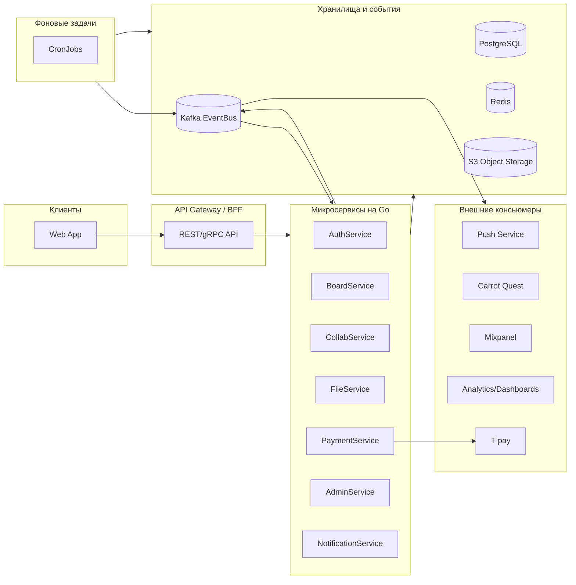
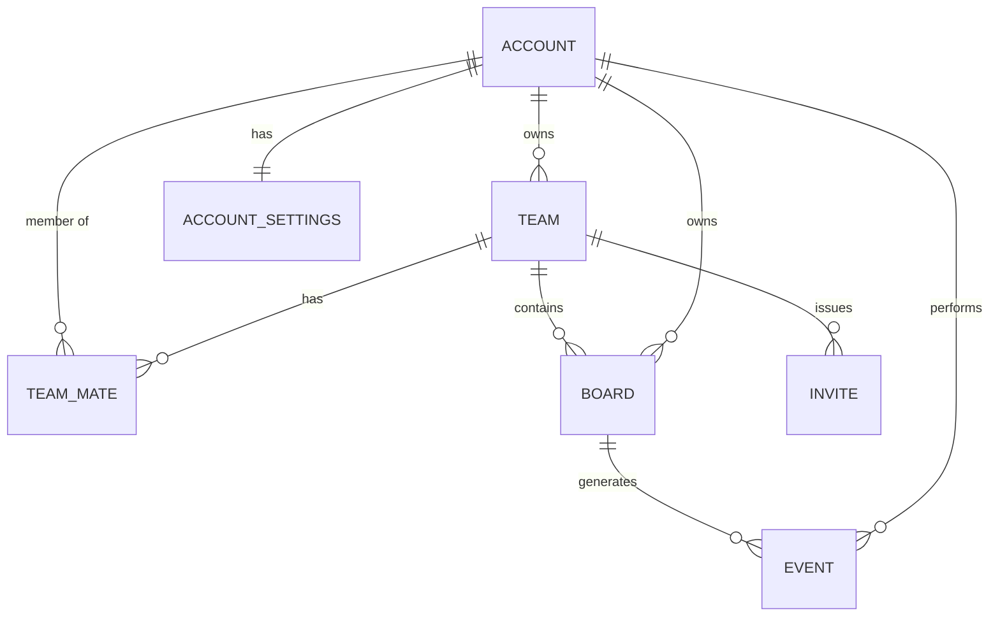
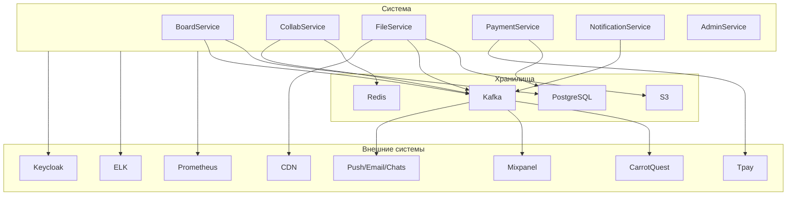

# Архитектура интерактивной онлайн-доски для совместной работы

## 1. Введение

Проект представляет собой **интерактивную онлайн-доску для совместной работы** (аналог Miro), которая позволяет нескольким пользователям одновременно работать на одной доске в реальном времени.  
Основные функции включают:
- создание и редактирование досок;
- добавление графических и текстовых элементов;
- совместное редактирование через WebSocket;
- комментарии, приглашения, экспорт/импорт данных;
- систему ролей (Guest, Edit, Owner).

Система построена на **микросервисной архитектуре** с использованием **Go (Golang)** на бэкенде и **React** на фронтенде.  
Для хранения данных используется **PostgreSQL** и **S3-совместимое хранилище**, а обмен событиями осуществляется через **Kafka**.

---

## 2. Архитектура системы (Frontend–Backend–DB–API)

Архитектура основана на микросервисном подходе с разделением по зонам ответственности.  
Клиент взаимодействует с системой через **API Gateway**, который маршрутизирует запросы к микросервисам.

### Схема архитектуры

### Описание уровней

- **Frontend** — React-приложение на TypeScript, использует REST и WebSocket для синхронизации.
- **Backend** — микросервисы на Go, взаимодействие по gRPC и через Kafka.
- **API Gateway** — единая точка входа с проверкой токенов и маршрутизацией.
- **Хранилища** — PostgreSQL для метаданных, Redis для сессий, S3 для версий досок.
- **Event Bus (Kafka)** — публикация и потребление доменных событий.
- **Внешние интеграции** — Keycloak, Tpay, CDN, аналитика, уведомления.

---

## 3. ER-диаграмма (сущности и связи)

Основные сущности: пользователи, команды, доски, события, приглашения.

**Описание ключевых таблиц:**
- **account** — пользователи системы (email, пароль, активность);
- **team** — рабочие пространства;
- **board** — доски (метаданные и ссылка на JSON-снимок в S3);
- **event** — история действий на доске;
- **invite** — приглашения с токенами;
- **team_mate** — роли участников в команде.

---

## 4. Диаграмма компонентов

---

## 5. Техническое обоснование выбранных решений

| Компонент                | Технология          | Обоснование                                                      |
|--------------------------|---------------------|------------------------------------------------------------------|
| **Frontend**             | React + TypeScript  | Высокая скорость разработки, SSR/CSR, JSX, зрелая экосистема.    |
| **Backend**              | Go (Golang)         | Простота, высокая производительность, поддержка многопоточности. |
| **API**                  | gRPC + REST         | gRPC — для микросервисов, REST — для фронтенда.                  |
| **PostgreSQL**           | Реляционная БД      | ACID, JSONB, масштабируемость.                                   |
| **Redis**                | In-memory cache     | Быстрый доступ к состоянию пользователей и presence.             |
| **S3**                   | Объектное хранилище | Хранение JSON-снимков и медиа с версионированием.                |
| **Kafka**                | Шина событий        | Асинхронная обработка событий и интеграция с аналитикой.         |
| **Keycloak**             | OpenID Connect IdP  | Централизованная авторизация и ролевая модель (RBAC).            |
| **Tpay**                 | Платёжный шлюз      | Рекуррентные платежи, вебхуки, токенизация карт.                 |
| **Prometheus / Grafana** | Мониторинг          | Метрики и визуализация состояния системы.                        |
| **ELK / Loki**           | Логи и аудит        | Централизованный сбор логов и DLP.                               |

---

## 6. Заключение

Архитектура системы обеспечивает:

- **Масштабируемость** — за счёт микросервисной структуры и контейнеризации (Kubernetes).
- **Надёжность** — PostgreSQL, Redis и S3 обеспечивают отказоустойчивость.
- **Гибкость** — новые микросервисы добавляются без влияния на существующие.
- **Реальное время** — через WebSocket и CollabService с Redis.
- **Устойчивость к сбоям** — Kafka гарантирует доставку событий и интеграцию с аналитикой.

Система поддерживает до **1000 активных пользователей** при задержках API менее 150 мс.  
Её можно масштабировать горизонтально, добавляя ноды и консьюмеры Kafka.  
Такая архитектура сочетает производительность, гибкость и простоту сопровождения, что делает её устойчивой к росту нагрузки и расширению функционала.
