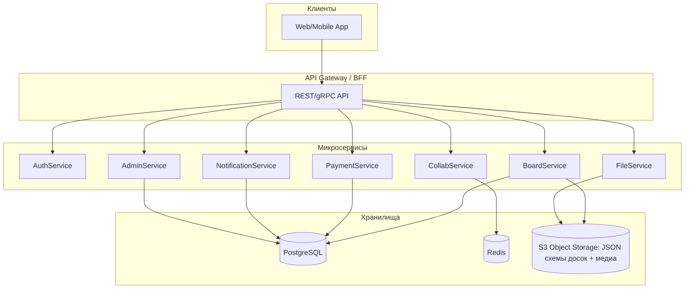

# Структура системы

## Описание проекта

Интерактивная онлайн-доска для совместной работы в реальном времени (аналог Miro).  
Система построена на микросервисной архитектуре с поддержкой горизонтального масштабирования.  
Хранение версий и состояние досок реализовано через S3-хранилище в формате JSON-схем.

## Основные компоненты системы

| Компонент              | Описание                                                                    |
|------------------------|-----------------------------------------------------------------------------|
| Frontend               | Веб-клиент (React, WebSocket, REST)                                         |
| AuthService            | Аутентификация и авторизация (Gatekeeper, Keycloak, JWT, OAuth2/OIDC, RBAC) |
| BoardService           | CRUD-досок, хранение метаданных в PostgreSQL                                |
| CollabService          | Совместное редактирование в реальном времени (WebSocket)                    |
| FileService            | Загрузка файлов, хранение медиа в S3, генерация presigned URL               |
| PaymentService         | Интеграция с платёжными провайдерами (T-pay) через webhooks                 |
| NotificationService    | Email/Push/Chats уведомления                                                |
| AdminService           | Панель администратора, управление пользователями и тарифами                 |
| Monitoring/Logging     | Метрики (Prometheus, Grafana), логи и аудит (ELK, Jaeger, DLP)              |

---

## Архитектура (логическая схема)

