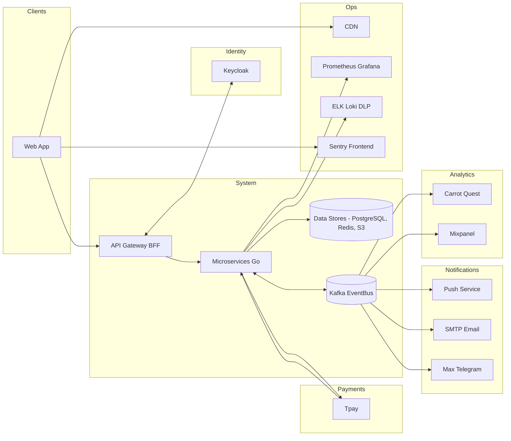

# Взаимосвязи системы с внешними смежными

## Обзор
Система интегрируется с внешними провайдерами аутентификации, платежей, уведомлений, аналитики, мониторинга и хранения.  
Все внешние обмены проходят через контролируемые интерфейсы (REST/webhook, Kafka-консьюмеры/продюсеры, SMTP/FCM) с аутентификацией и подписанием.

Особенности:
- CDN не вызывается напрямую из микросервисов. `FileService` генерирует **presigned URL** к объектам в S3, и контент раздаётся через CDN напрямую клиентам.
- Sentry используется только на **Frontend**, для сбора ошибок и перфоманса клиентской части.
- Keycloak и Gatekeeper отвечают за регистрацию / авторизацию и валидацию токенов.
- Tpay платежный провайдер. Умеет делать прямые а так же рекурентные платежи на основании сохраненного токена карты пользователя.
- Carrot quest и Mixpanel а так же возможность подключение любых других систем для коммуникации с пользователями через единое место.

## Карта интеграций

| Группа            | Система/Провайдер                   | Назначение                                      |
|-------------------|-------------------------------------|-------------------------------------------------|
| Идентификация     | Keycloak (OIDC/SAML)                | Логин/SSO, проверка токенов, RBAC               |
| Платежи           | T-pay (webhooks)                    | Привязка карт, рекуррентные списания, статусы   |
| Хранилище         | S3-совместимое хранилище            | JSON-версии досок и медиа                       |
| Уведомления       | FCM/APNs/Email/Chats (Max/Telegram) | Push, email, чат-нотификации                    |
| Аналитика         | Carrot Quest, Mixpanel              | Поведение пользователей, продуктовые метрики    |
| Доставка статики  | CDN                                 | Раздача файлов и пользовательских медиа         |
| Мониторинг        | Prometheus/Grafana                  | Метрики и алерты                                |
| Логи/Аудит        | ELK/Loki, DLP                       | Централизованные логи, контроль утечек          |
| Event Bus         | Kafka                               | Доменные события и интеграционные потоки        |
| Ошибки фронтенда  | Sentry                              | Трекинг ошибок и перфоманса клиентской части    |

> Схемы событий фиксируются в Schema Registry (JSON-Schema/Proto). Вебхуки валидируются по подписи/secret.

## Диаграмма взаимодействий (по уровням)

