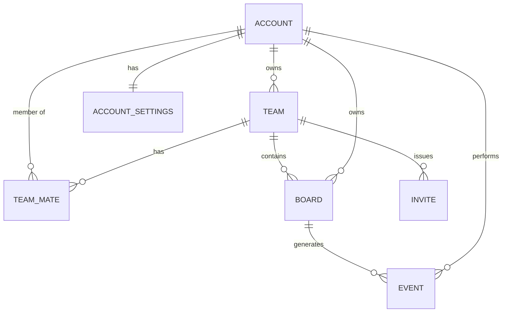

# Описание информационного обеспечения системы

## Обзор
Информационное обеспечение включает в себя:
- логическую модель данных (доски, пользователи, тарифы, платежи);
- хранилища (PostgreSQL, Redis, S3);
- форматы хранения (реляционные таблицы, JSON-схемы для досок);
- правила версионирования и политики жизненного цикла данных;
- индексацию и аудит.

Цель: обеспечить целостность, доступность и непротиворечивость информации при масштабируемой работе системы.

## Основные сущности и таблицы (PostgreSQL)

### Board
```sql
CREATE TYPE role_type AS ENUM ('owner', 'admin', 'editor', 'viewer');

CREATE TABLE board (
    id              UUID PRIMARY KEY,
    team_id         UUID NOT NULL,
    owner_id        UUID NOT NULL,
    title           TEXT NOT NULL,
    description     TEXT,
    created_at      TIMESTAMPTZ DEFAULT now(),
    updated_at      TIMESTAMPTZ DEFAULT now(),
    is_archived     BOOLEAN DEFAULT false,
    version_ref     TEXT -- ссылка на ключ в S3 с JSON-схемой текущей версии
);

CREATE TABLE account (
    id              UUID PRIMARY KEY,
    email           CITEXT UNIQUE NOT NULL,
    password_hash   TEXT,
    display_name    TEXT,
    created_at      TIMESTAMPTZ DEFAULT now(),
    last_login_at   TIMESTAMPTZ,
    is_active       BOOLEAN DEFAULT true
);

CREATE TABLE team (
    id              UUID PRIMARY KEY,
    name            TEXT NOT NULL,
    owner_id        UUID NOT NULL,
    created_at      TIMESTAMPTZ DEFAULT now()
);

CREATE TABLE team_mate (
    id              UUID PRIMARY KEY,
    team_id         UUID NOT NULL,
    account_id      UUID NOT NULL,
    role            role_type NOT NULL,    
    created_at      TIMESTAMPTZ DEFAULT now(),
    UNIQUE(team_id, account_id)
);

CREATE TABLE event (
    id              BIGSERIAL PRIMARY KEY,
    board_id        UUID NOT NULL,
    account_id      UUID,
    event_type      TEXT NOT NULL, -- create_object, update_object, comment и т.п.
    payload         JSONB NOT NULL, -- параметры события
    created_at      TIMESTAMPTZ DEFAULT now()
);
CREATE INDEX idx_event_board ON event(board_id, created_at);

CREATE TABLE account_settings (
    account_id      UUID PRIMARY KEY,
    locale          TEXT DEFAULT 'en',
    theme           TEXT DEFAULT 'light',
    notifications   JSONB DEFAULT '{}' -- гибкие настройки уведомлений
);

CREATE TABLE invite (
    id              UUID PRIMARY KEY,
    account_id      UUID NOT NULL,
    team_id         UUID NOT NULL,
    email           CITEXT NOT NULL,
    role            role_type NOT NULL,
    token           TEXT NOT NULL UNIQUE,
    expires_at      TIMESTAMPTZ NOT NULL,
    created_at      TIMESTAMPTZ DEFAULT now(),
    accepted        BOOLEAN DEFAULT false
);
```

## ER-диаграмма основных сущностей



## JSON-схема снимка доски

```json
{
  "board_id": "string",
  "last_event": "int64", 
  "entities": [
    {
      "id": "string",
      "type": "string", 
      "data": {}
    }
  ]
}
```
## JSON-схема эвента ws

```json
{
  "board_id": "string",
  "entity": {
    "id": "string",
    "type": "string"
  },
  "action": "create | update | delete",
  "payload": {}
}
```
